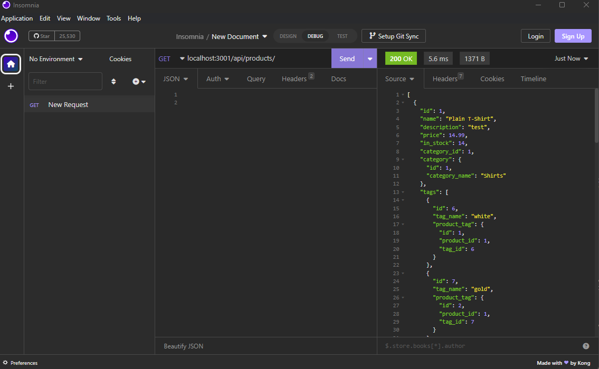

# Ecommerce Express server



[link to video walkthrough](https://drive.google.com/file/d/1gykVwcML_393x6QeA7JQxo22TY8dwPQr/view)

## Description

This express app acts as a server an ecommerce application that allows users to view all products, categories, and product tags.

- [x] Users can update products, tags, and categories.
- [x] Users can delete products, tags, and categories.

### Usage

To use this web app, go to the different API endpoints located at

```
http://localhost:3000/api/products
```

```
http://localhost:3000/api/products/:id
```

```
http://localhost:3000/api/categories
```

```
http://localhost:3000/api/categories/:id
```

```
http://localhost:3000/api/tags
```

```
http://localhost:3000/api/tags/:id
```

### Installation

clone repo to local machine and cd into dir/

```
cd ecommerce-server/
```

install dependencies

```
npm install
```

configure Sequelize environmental variables with mySQL credentials

```
add variables to .env file
```

seed mySQL database

```
npm run seed
```

start server

```
node server.js
```

### Credits

N/A

### License

MIT License
